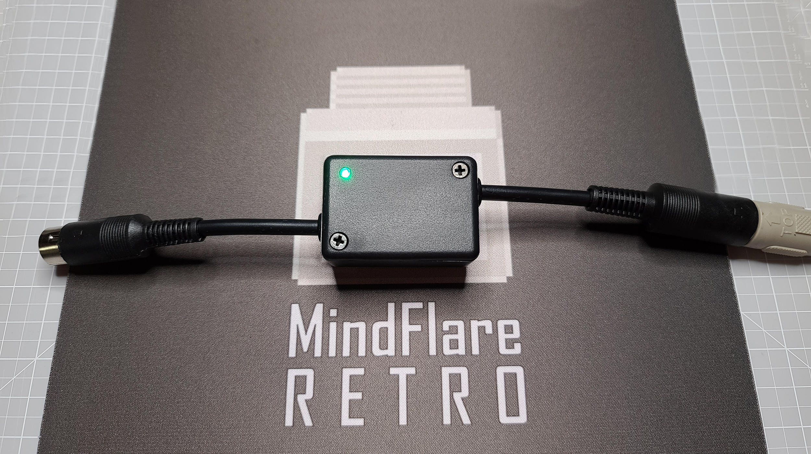

# C64 Saver V2.4 Build Guide

[](https://creativecommons.org/licenses/by-nc/4.0/)
[](https://c64saverbuild.mindflareretro.com)
[](https://mindflareretro.github.io/C64-Saver-V2.4-Build-Guide/)

A comprehensive step-by-step build guide for [@bwack's](https://github.com/bwack) **C64 Saver V2.4** — an inline over-voltage protection device that defends your Commodore 64 from a failing power supply.

<p align="center">
  
</p>

---

## 🌐 Read the Guide

| | URL |
|---|---|
| **Primary** | https://c64saverbuild.mindflareretro.com |
| **GitHub Pages mirror** | https://mindflareretro.github.io/C64-Saver-V2.4-Build-Guide/ |

---

## About the C64 Saver

The original Commodore 64 power supply — that iconic black or beige "brick" with the C= logo — is one of the most notorious failure points in the entire C64 ecosystem. After 40+ years, the internal 5VDC voltage regulator can fail **catastrophically**, sending an uncontrolled surge directly into your C64's sensitive RAM chips and ICs.

The **C64 Saver V2.4**, designed by [@bwack](https://github.com/bwack), is a compact inline protection device that monitors the 5VDC rail and *instantly* disconnects power the moment voltage rises above a safe threshold. It sits between your PSU and C64 — completely transparent in normal operation. Until the day it saves your machine.

This repository hosts the complete written build guide that accompanies the [MindFlareRetro YouTube video series](https://www.youtube.com/@MindFlareRetro).

---

## ✨ Guide Features

- **Skill-level toggle** — Novice mode includes extra theory and detail; Expert mode shows just the essentials
- **Complete Bill of Materials** — every part with verified DigiKey Canada and USA purchase links
- **Step-by-step instructions** — 9 build steps with photos, diagrams, and inline warnings
- **Theory of operation** — understand *how* the circuit protects your C64, not just how to build it
- **Embedded video series** — 3-part MindFlareRetro YouTube build series inline
- **DIN connector pinout reference** — color-coded wiring guide for the 7-pin DIN
- **Testing & verification** — multimeter checks before you plug into your C64
- **Mobile responsive** — read it on your phone while soldering
- **Click-to-enlarge lightbox** — zoom in on any reference image
- **No build step required** — single-page vanilla HTML/CSS/JS, opens in any browser

---

## How to View the Guide

You have three options:

1. **Visit the live site** — https://c64saverbuild.mindflareretro.com
2. **Open locally** — clone this repo and open `index.html` in your browser
3. **Serve locally** with a quick HTTP server:
   ```bash
   # Python
   python -m http.server 8000

   # or Node
   npx serve .
   ```
   Then visit http://localhost:8000

---

## Project Structure

```
.
├── index.html        # The entire build guide (single page)
├── img/              # Photos, diagrams, logos (all MindFlareRetro-watermarked)
├── resources/        # Schematic reference
└── README.md         # This file
```

---

## Credits & Attribution

| Contribution | Credit |
|---|---|
| **Circuit & PCB design** | [@bwack](https://github.com/bwack) ([YouTube](https://www.youtube.com/@bwack)) |
| **3D-printed enclosure photo** | [@leelegionsmith on Printables](https://www.printables.com/model/106673-c64-saver-case) |
| **Build guide, photography, video series** | [MindFlareRetro](https://www.mindflareretro.com) |
| **Commodore 64 & Commodore logo** | Trademarks of [Commodore International Corporation](https://www.commodore.net/) |

---

## License

This build guide is licensed under the [Creative Commons Attribution-NonCommercial 4.0 International License (CC BY-NC 4.0)](https://creativecommons.org/licenses/by-nc/4.0/).

You are free to:

- **Share** — copy and redistribute the material in any medium or format
- **Adapt** — remix, transform, and build upon the material

Under the following terms:

- **Attribution** — Credit *MindFlareRetro* (this guide) and *@bwack* (the circuit design)
- **NonCommercial** — Not for commercial use

[](https://creativecommons.org/licenses/by-nc/4.0/)

> **Disclaimer:** This build guide is provided for educational and informational purposes only. MindFlareRetro assumes no liability for damage to equipment, property, or persons resulting from the construction, modification, or use of the device described herein.

---

## Connect with MindFlareRetro

- 🎬 **YouTube** — https://www.youtube.com/@MindFlareRetro
- 🌐 **Website** — https://www.mindflareretro.com
- 💾 Preserving and celebrating classic Commodore hardware since 2019

---

<sub>© MindFlareRetro · C64 Saver circuit design © @bwack</sub>
